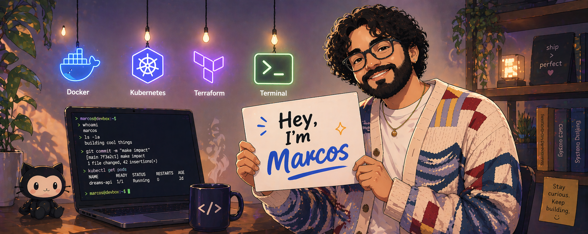

## About Me

I think one of the things I struggle with at times is understanding who I truly am. Sometimes I know myself, and other times I do not. Sometimes I find myself bold and zealous, passionate about doing what is right and living with gratitude for life. Other times, I find myself selfish and not great at relationships.

No matter what I feel internally, though, I want to have a positive impact on others and step out of my comfort zone to lend a hand when I can. That's what I believe life is ultimately about: it is better to give to others than to receive.

## Outside of Work

I enjoy a good pair of sneakers, preferably Jordans, and fashion in general. I love anything with floral embroidery. I love looking at the sky sometimes and seeing how beautiful God has made creation. I love those soft, smushy feelings of love for other people and wanting to be kind to them.

Classical music is a thing for me, and I enjoy a good workout and protein shake. Chocolate flavor is a must.

A ’67 Mustang is a dream car of mine.

A small town called Lakenheath, England, will always be my childhood home.

I have not gamed in a while, but Star Wars: Knights of the Old Republic is still GOATED!

## Tools I Reach For

  
  
  
  
  

## Soundtrack, Lately

  

